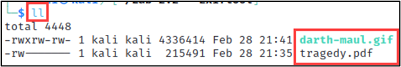

# Lab - exiftool

!!! tip "Lab Setup"
    1) Log into The Forge VM 
    
    2) Change directories (via the cd command) to this Lab’s directory `~/ITOT_Lab_Files/exiftool/` using the below command.

```bash
cd ~/ITOT_Lab_Files/exiftool/
```

## Intro

Photos can contain hidden data that can reveal important information about their origin or creator. Exiftool is a command-line tool that allows you to extract, edit, and manipulate metadata from images and other types of files. In this lab, you will learn how to use Exiftool to extract hidden data from images and other types of files.

## Walkthrough

List the contents of the directory using the below command.

```bash
ll
```

{ width="70%" }
/// caption
Directory Contents
///
Directory Contents

Let’s look at the PDF file by opening it with the below command.

```bash
open tragedy.pdf
```

Have you ever heard The Tragedy of Darth Plagueis The Wise? Well now you have. 😉

```bash
exiftool tragedy.pdf
```

The command `exiftool tragedy.pdf` is displaying all the metadata information for the PDF file named "tragedy.pdf" using the Exiftool software. It will show metadata such as author, creation date, modification date, and other properties associated with the PDF file.

{ width="70%" }
/// caption
Metadata
///
Metadata

```bash
exiftool -Description="I am the Senate" tragedy.pdf
```

This command would modify the Description metadata field of the "tragedy.pdf" file to the value "It's treason then".

{ width="70%" }
/// caption
File Updated
///
File Updated

Let’s look at our changes with the below command.

```bash
exiftool tragedy.pdf
```

{ width="70%" }
/// caption
Updated Metadata
///
Updated Metadata

## Challenge

1. What other metadata fields can be changed in a PDF file using exiftool?
2. Try making some changes of your own.
3. What interesting information is in the other file from the Lab directory?