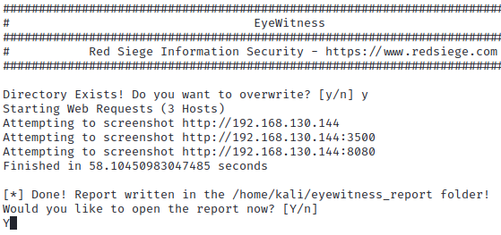

# Lab - EyeWitness

!!! tip "Lab Setup"
    1) The XML output file from the Nmap 3 Lab.

    2) Metasploitable3 VM running

## Intro

Visualizing and documenting your security findings is essential for effective reporting and communication with stakeholders. EyeWitness is a tool that captures screenshots of web applications and automatically creates reports with detailed information about the target. In this lab, you will learn how to use EyeWitness to capture screenshots of web applications and create comprehensive reports.

## Walkthrough

Use the Nmap **XML** output file for Lab 3 and pass it into EyeWitness using the below command…

```bash
eyewitness -x ~/nmap_lab.xml -d ~/eyewitness_report
```

{ width="70%" }
/// caption
EyeWitness Execution
///
EyeWitness Execution

Make sure you type `Y` and hit `Enter` after the EyeWitness command runs. This will open your browser to show you the report containing screenshots and additional information on our targets.

Your browser should open and display the report from the `-d eyewitness_report` option you set.

You’ll see a Table of Contents that attempts to categorize the report.

{ width="70%" }
/// caption
Report TOC
///
Report TOC

There should be 3 items in the report. Some will have screenshots accompanying them. One of which is a screenshot from port 80 that was discovered from the Nmap scan.

{ width="70%" }
/// caption
Port 80
///
Port 80

## Challenge

Try navigating to the URL in the “Web Request Info” column and seeing what’s there. Anything interesting? Maybe some vulnerable web applications you can explore on your own?