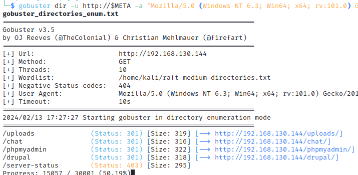

# Lab - Gobuster

!!! tip "Lab Setup"
    Log in to The Forge VM.

Start the Metasploitable3 VM and login using the username `vagrant` and password `vagrant`.

## Intro

Discovering hidden directories and files is crucial in many security assessments. Gobuster is a tool that helps you find these hidden paths by launching brute-force attacks on web servers. In this lab, you will learn how to use Gobuster to scan web servers and discover hidden directories and files that are not immediately visible to regular users.

## Walkthrough

Run the Gobuster command below.

The command is searching for directories on a website located at `http://192.168.130.144` (running on our Metasploitable3 VM).

!!! warning "This IP Address is likely different from yours so replace it with the one you found in the setup steps."

```bash
gobuster dir -u http://$META -a "Mozilla/5.0 (Windows NT 6.3; Win64; x64; rv:101.0) Gecko/20100101 Firefox/101.0" -w ~/ITOT_Lab_Files/gobuster/raft-medium-directories.txt -o ./gobuster_directories_enum.txt
```

{ width="70%" }
/// caption
Directory Enumeration
///
Directory Enumeration

The `-a` option is used to specify a user agent string, which is a piece of information that tells the server what web browser is being used to make the request. In this case, the user agent string is `"Mozilla/5.0 (Windows NT 6.3; Win64; x64; rv:101.0) Gecko/20100101 Firefox/101.0"`, which is pretending to be Firefox running on a Windows 8.1 computer.

The `-w` option specifies a wordlist, which is a list of potential directory names to check. The wordlist being used is located at `~/raft-medium-directories.txt`.

Finally, the `-o` option specifies the output file for the results, which will be saved to a file called `gobuster_directories_enum.txt` in the current directory.

Next lets try the below command to search for interesting files on the web server.

```bash
gobuster dir -u http://$META -a "Mozilla/5.0 (Windows NT 6.3; Win64; x64; rv:101.0) Gecko/20100101 Firefox/101.0" -w ~/ITOT_Lab_Files/gobuster/raft-medium-files.txt -o ./gobuster_files_enum.txt
```

{ width="70%" }
/// caption
File Enumeration
///
File Enumeration

The second command is similar to the first one, but instead of enumerating directories, it is enumerating files. The `-w` option is pointing to a different wordlist of potential files (`raft-medium-files.txt`), and the -o option is specifying a different output file (`gobuster_files_enum.txt`). This command would scan the specified target URL for any files that match the entries in the wordlist and output the results to the specified file.

We can view the results of each in the terminal as they run AND by looking at the output each of the out files individually with the below commands.

```bash
cat gobuster_directories_enum.txt
```

…and…

```bash
cat gobuster_files_enum.txt
```

{ width="70%" }
/// caption
Gobuster Results
///
Gobuster Results

Try navigating to each of those directories and files in your Forge VM’s Firefox browser. What do you see?

## Challenge

Spin up OWASP Juice Shop on your Forge VM using the commands from Lab 0. Then target that system with Gobuster. You should get some interesting results to check out.