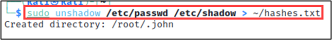

# Lab - John the Ripper

!!! tip "Lab Setup"
    We’ll be using The Forge VM for this Lab.

## Intro

Cracking passwords is a common task in many security assessments. John the Ripper is a powerful password cracking tool that uses different attack methods to guess passwords. In this lab, you will learn how to use John the Ripper to crack passwords using various attack methods.

## Walkthrough

The below command creates a file called "hashes.txt" in the home directory of the current user, which contains the password hashes for all the user accounts on the system. It does this by merging the password and hash information from the `/etc/passwd` and `/etc/shadow` files, respectively, and outputting the result to the hashes.txt file. The `sudo` command is used to run the `unshadow` command with elevated privileges, which may be required to access the password hashes.

```bash
sudo unshadow /etc/passwd /etc/shadow > ~/hashes.txt
```

!!! warning ""
    For our purposes in this Lab, we assume that we’ve already gained access to a victim machine with a privileged account.

{ width="70%" }
/// caption
Unshadow Command
///
Unshadow Command

Our next command tests John the Ripper's ability to recognize the crypt hash format and benchmark the capability our your VM.

The `--test` option tells John to run in test mode, which means that it will not attempt to crack any passwords. The `--format=crypt` option specifies the hash format to test against, which is the Unix crypt format in this case.

```bash
sudo john --test --format=crypt
```

{ width="70%" }
/// caption
Benchmarking
///
Benchmarking

The `c/s` number represents the approximate password crack attempts per second.

!!! info ""
    We’re now going to switch and use a pre-pared `hashes.txt` file included with your VM. This is just to ensure the Lab executes correctly each time.

The following command will try to crack the passwords for the hashes stored in the `hashes.txt` file using the wordlist located at `~/john_lab_passwords.lst`. It will apply the rules specified in the `john` configuration file to generate additional variations of the passwords to increase the chances of cracking them. The `--format=crypt` option indicates that the hashes are in Unix crypt format.

```bash
sudo john --wordlist=/home/telchar/ITOT_Lab_Files/johntheripper/john_lab_passwords.lst --rules --format=crypt /home/telchar/ITOT_Lab_Files/johntheripper/hashes.txt
```

In the interest of time and the Lab, the provided wordlist is shorter than a typical attacker would use. It also does include passwords for numerous accounts in the `hashes.txt` file.

Let’s see if you’re successful in cracking those passwords…

{ width="70%" }
/// caption
Password Cracking
///
Password Cracking

One of the most powerful features of John the Ripper is that it will remember all the passwords it has cracked and their related hashes. The below command will show the cracked passwords for the hashes stored in the `hashes.txt` file. If any of the passwords have been successfully cracked by John the Ripper, they will be displayed in the terminal.

```bash
sudo john --show ~/ITOT_Lab_Files/johntheripper/hashes.txt
```

{ width="70%" }
/// caption
Cracked Hashes
///
Cracked Hashes

This helps save time when using the same instance of john to crack hashes from many sources. As it won’t attempt to crack passwords it has already successfully done before.

The tool remembers cracked passwords in a `.pot` file it stores on your attacker/Forge VM. Let’s try to find it.
The `updatedb` command updates the database used by the `locate` command, which is a tool for finding files on a system by name. The `sudo` prefix gives the command root privileges, allowing it to index system files that are not accessible to regular users.

```bash
sudo updatedb
```

The command below searches for all files with the ".pot" extension on the system. The "locate" command looks for filenames that match a pattern, and it searches a pre-built database of the filesystem, which makes it faster than using the "find" command.

```bash
locate .pot
```

{ width="70%" }
/// caption
Locate Command
///
Locate Command

There it is!

We can read its contents with the below `cat` command.

```bash
sudo cat /root/.john/john.pot
```

{ width="70%" }
/// caption
.pot File
///
.pot File

Here we see the password hashes alongside their cleartext companions.

We can clear this memory of past cracks with the below command and reset john to its original state.

```bash
sudo rm /root/.john/john.pot
```

Now the `--show` option will not have any results for our hashes.txt file.

```bash
sudo john --show ~/ITOT_Lab_Files/johntheripper/hashes.txt
```

{ width="70%" }
/// caption
Clearing Cracked Passwords
///
Clearing Cracked Passwords

We’ve now purged John the Ripper’s knowledge of past cracked passwords. You can re-run the lab with the below command if you wish.

```bash
sudo john --wordlist=~/ITOT_Lab_Files/johntheripper/john_lab_passwords.lst --rules --format=crypt ~/ITOT_Lab_Files/johntheripper/hashes.txt
```