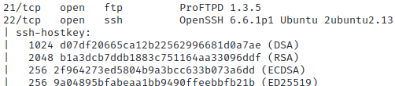

# Lab - Nmap

!!! tip "Lab Setup"
    Start up the Metasploitable3 VM and login.

Run the `ifconfig` command to display the VM’s network interface information.

## Intro

Nmap is a powerful tool used for network exploration, management, and security auditing. It can help you discover hosts and services on a network, map out your network topology, and identify security risks. In this lab, you will learn how to use Nmap to scan a network, discover hosts and services, and identify security vulnerabilities.

## Walkthrough

Scan Metasploitable3 VM using Nmap on The Forge VM.

!!! warning "This can take several minutes to complete depending on your setup."

```bash
sudo nmap -p- -A -Pn -oA nmap_lab $META
```

We’re doing a few things with this scan…

- Running as root with the elevated `sudo` This gives nmap additional abilities.
- The option `-p-` directs nmap to conduct a “full port scan” of all 65,535 TCP ports.
- Nmap is doing an “aggressive” scan by using the `-A`
    - Enables OS detection, version detection, script scanning, and traceroute
- Creating output file(s) by using the `-oA nmap_lab` for other tools to consume
    - **We’re going to use this output in the next Labs!**

Review the results…

Looks like FTP and SSH are open.

{ width="70%" }
/// caption
FTP & SSH
///
FTP & SSH

HTTP (web service) are also accessible.

{ width="70%" }
/// caption
HTTP
///
HTTP

A database and IRC also appear to be running on the target.

{ width="70%" }
/// caption
MySQL & IRC
///
MySQL & IRC

Note how most of these open services have NSE script results displayed with them. Giving you (the attacker) additional information that could be used in later phases of our attack and helps determine where to spend our time.