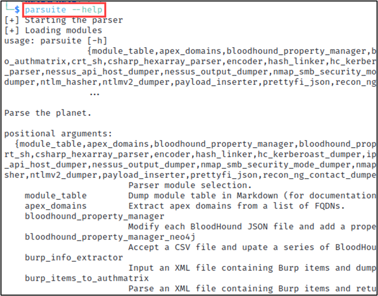

# Lab - Parsuite

!!! tip "Lab Setup"
    The XML output file from the Nmap Lab 3.

!!! warning ""
    You might have to run `source .bashrc` IF your terminal say it can’t find the `parsuite` command.

## Intro

Simple modular framework to support quick creation of file parsers in Python.

## Walkthrough

First, let’s look at the help context for Parsuite using the command below.

```bash
parsuite --help
```

{ width="70%" }
/// caption
Parsuite Help
///

Note all the **32** different modules that Parsuite supports:

- apex_domains
- bloodhound_property_manager
- bloodhound_property_manager_neo4j
- burp_info_extractor
- burp_items_to_authmatrix
- burp_to_authmatrix
- crt_sh
- csharp_hexarray_parser,
- encoder
- hash_linker
- hc_kerberoast_dumper
- ip_expander
- ip_sorter
- ldap_dissection_xml_dumper
- line_filter
- module_table
- moz_cookies_parser
- nessus_api_host_dumper
- nessus_output_dumper
- nmap_smb_security_mode_dumper
- nmap_ssl_name_dumper
- nmap_to_sqlite
- nmap_top_port_dumper
- nmap_xml_service_dumper
- ntlm_hasher
- ntlmv2_dumper
- payload_inserter
- prettyfi_json
- recon_ng_contact_dumper
- socket_dumper
- string_randomizer
- templatizer,xml_dumper

Parsuite has many modules! Including ones for Bloodhound, Nessus, Recon-ng, and Nmap.

We’ll be focusing on the Nmap ones for parsing the results of our previous Lab.

- nmap_smb_security_mode_dumper
    - Dump hosts to a file containing the security mode discovered by smb-security-mode.
- nmap_ssl_name_dumper
    - Accept a XML file generated by Nmap and write SSL certificate information to stdout
- nmap_to_sqlite
    - Convert XML files generated by NMap to an SQLite database.
    - WARNING: This is still in development and produces highly inefficient associations. It works, but the DB size will be large and there will likely be duplicate port/host statuses.
- nmap_top_port_dumper
    - Parse the Nmap services file and dump the most commonly open ports.
- nmap_xml_service_dumper
    - Accept a XML file generated by Nmap and write the output to a local directory structure, organized by service, for easy browsing.

Use the Nmap **XML** output file for Lab 3 and pass it into Parsuite using the below command…

```bash
parsuite nmap_xml_service_dumper --input-file ~/nmap_lab.xml --output-directory ~/parsuite_output
```

{ width="70%" }
/// caption
Output
///

Now let’s dive into the Parsuite output a bit.

```bash
cd ~/parsuite_output
```

{ width="70%" }
/// caption
Services Organized into Directories
///

Let’s view the results in the `http` service directory by running the command below.

```bash
cat http/tcp_sockets.txt
```

{ width="70%" }
/// caption
Systems and Ports Running a HTTP Service
///

As can be seen from the screenshot above, the system IP addresses and ports where HTTP services were detected by `nmap` are now neatly collected. This can help with easy transfer into reports or communications with the customer.

Since we only have one target machine for our labs, this is a very simplified example. Imagine yourself scanning an environment that has dozens, hundreds, or thousands of systems in-scope. Being able to quickly aggregate which systems have similar services together can greatly reduce subsequent efforts of verification and exploitation.