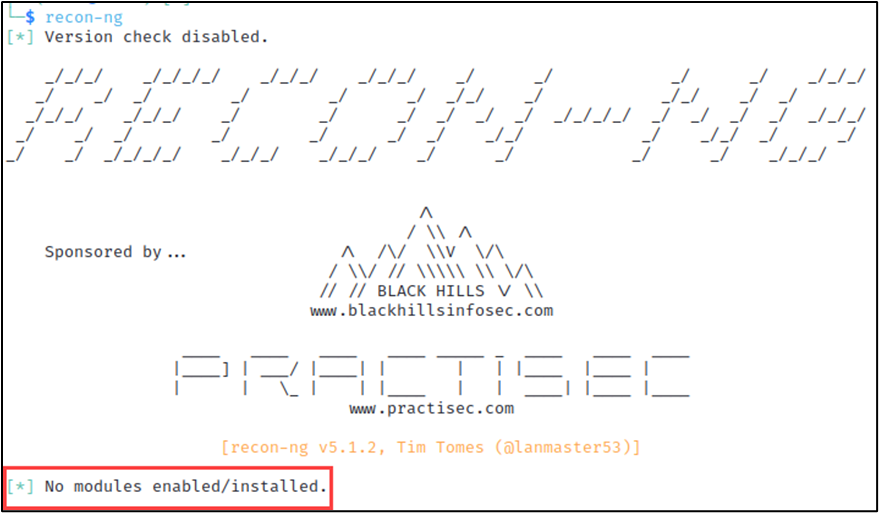

# Lab - Recon-ng

!!! tip "Lab Setup"
    Power on and login (telchar:ridgeback) to The Forge VM

## Intro

Are you interested in gathering as much information as possible about a target before launching an attack? Look no further than Recon-ng, a powerful reconnaissance framework that will help you discover hidden data and build detailed intelligence on your targets. In this hands-on lab, you will learn how to use Recon-ng to gather information from various sources and pivot through discovered data to find new targets.

## Walkthrough

First, open a new terminal session in your Forge VM.

Start Recon-ng by running the below command…

```bash
recon-ng
```

{ width="70%" }
/// caption

///
Initial Launch Screen

Execute the below command…

```bash
marketplace refresh
```

This refreshes the list of available Recon-ng modules and adds any newly available modules to the Recon-ng workspace. The marketplace is a list of Recon-ng modules that can be downloaded and installed to extend the functionality of Recon-ng. Running this command ensures that the list is up to date with the latest available modules.

{ width="70%" }
/// caption

///
Index Refreshed

!!! warning "OPTIONAL - The below command may take a while to complete depending on you connection speed. You can skip this command and install only the required module shown in the following command."

```bash
marketplace install all
```

This will install all available Recon-ng modules and extensions that are listed in the marketplace. This command is useful when setting up a new Recon-ng environment or when you want to ensure that you have all available modules installed.

Executing the below command will install roughly…

- 85 Recon modules
- 13 Disabled modules
- 8 Reporting modules
- 4 Import modules
- 2 Exploitation modules
- 2 Discovery modules

{ width="70%" }
/// caption

///
Installing All Available Modules

!!! warning "REQUIRED – Install at least the below two modules for this lab."

```bash
marketplace install recon/domains-hosts/hackertarget
```

…and…

```bash
marketplace install reporting/html
```

Workspaces allow for easy delineation between targets and engagements.

Execute the below command…

```bash
workspaces create google
```

This Recon-ng command creates a new workspace named "google". A workspace is a container for a set of data and configurations used in Recon-ng. Workspaces allow users to keep different projects separated and organized.

The terminal prompt should now reflect we are operating within the “google” workspace.

{ width="70%" }
/// caption

///
New Workspace

Execute the below command…

```bash
modules search hackertarget
```

This searches the Recon-ng marketplace for modules related to "hackertarget" and displays them. This allows the user to quickly identify and select modules that may be useful for their reconnaissance tasks.

{ width="70%" }
/// caption

///
Module Search Functionality

Execute the below command…

```bash
modules load recon/domains-hosts/hackertarget
```

The command above loads the `hackertarget` module in the `domains-hosts` category of the Recon-ng framework. This module provides domain and IP address enumeration for the target domain using the services provided by hackertarget.com. Once loaded, the module can be used for further reconnaissance and information gathering on the target domain.

This module uses the HackerTarget.com API to find host names. Then it updates the 'hosts' table with the results.

Execute the below command…

```bash
info
```

The `info` command in Recon-ng displays general information about the current workspace, including the number of hosts, domains, and other data that has been gathered. It can also show the current configuration settings for Recon-ng.

{ width="70%" }
/// caption

///
Module Info

Note the `default` source for the module is the `domains` database table. We haven’t added any domains to that table yet. So let’s do that next…

Execute the below command…

```bash
db insert domains
```

This Recon-ng command will insert discovered domain names into the database for further enumeration and analysis. It allows users to store and manage the information gathered during the reconnaissance phase of a penetration test or security assessment.

You will be prompted to enter a domain and notes for the entry. You can leave the notes entry blank (as shown below).

{ width="70%" }
/// caption

///
Domain Added

Execute the below command…

```bash
show domains
```

The `show domains` command in Recon-ng displays a list of all the domains that have been added to the current workspace. This command is used to view the domains that have been discovered or added to the workspace during the reconnaissance phase. It is a quick way to check which domains are available in the current workspace and to verify that Recon-ng is properly detecting the domains that are being targeted.

{ width="70%" }
/// caption

///
Domains Table Content

Now, let’s run the module and see what we find!

Execute the below command…

```bash
run
```

The "run" command in Recon-ng initiates the execution of the module currently selected in the framework. The user must select a module prior to running this command, and the module will perform its specified task using the data in the workspace.

{ width="70%" }
/// caption

///
501 New Hosts Discovered

501 new hosts were discovered from running this module. These hosts and their IP addresses were automatically added to the `hosts` DB table for further recon.

Let’s take things one step further and see what modules exist that take the contents of the hosts DB table as source/input data. Execute the below command…

```bash
modules search /hosts-
```

!!! warning "The above command will only show the following results IF you installed all the modules earlier."

Note the “/hosts-“ term. That states we want to see modules that use data in the hosts DB table. This command searches for all Recon-ng modules that contain "/hosts-" in their name.

{ width="70%" }
/// caption

///
Module Search Results

These modules could provide valuable follow-up actions to further recon efforts.

Let’s now look at some options for reporting that can export our recon results in a consumable format. Execute the below command…

```bash
modules search reporting/
```

!!! warning "The above command will only show the following results IF you installed all the modules earlier."

This command searches for all Recon-ng modules that contain "reporting/" in their name.

{ width="70%" }
/// caption

///
Reporting Modules

If you didn’t install all the modules earlier, you can install the required reporting module with the below command.

Let’s install, load, and use the reporting/html module. Execute the below command…

```bash
modules load reporting/html
```

This command loads the "html" module under the "reporting" category into Recon-ng. This module generates an HTML report of the current workspace's data, which can be viewed in a web browser.

The module’s info shows two required option values that we need to set in order to use the module.

```bash
info
```

{ width="70%" }
/// caption

///
Module Info

These can be set using the `options set [variable_name] [value]` format like below.

```bash
options set CREATOR Awesome Pentester
```

```bash
options set CUSTOMER Google
```

{ width="70%" }
/// caption

///
Set Options

Now that all the options are set, let’s create the HTML report by using the `run` command and see what it looks like.

```bash
run
```

{ width="70%" }
/// caption

///
HTML Report Created

Now exit Recon-ng with the below command.

```bash
exit
```

Let’s take a look at the report we created by running the below command to open the report in Firefox.

```bash
firefox /home/telchar/.recon-ng/workspaces/google/results.html
```

{ width="70%" }
/// caption

///
Report Snippet

## Challenge

Now that you’ve got the hang of things, create a new workspace, choose a target, and try doing recon on your own. Explore some of the other modules out there. Just avoid using any labeled “Exploitation” (examples shown below) as these will start to cross the line between reconnaissance and attacking (which we don’t do without permission).

{ width="70%" }
/// caption

///
Exploitation Modules